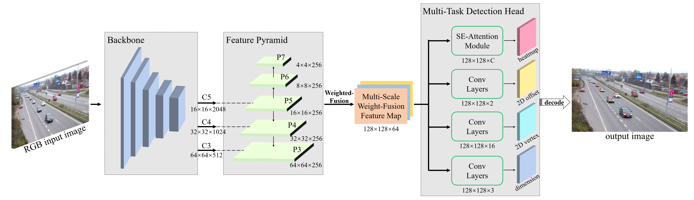

# CenterLoc3D: Monocular 3D Vehicle Localization Network for Roadside Surveillance Cameras

Pytorch implementation of 3D vehicle detection and localization network for roadside surveillance cameras.


[Demo Video](https://drive.google.com/file/d/15dLGES205TwV8rbcV1YGJXXhXfRO8nid/view?usp=sharing)

***
## Environments

- Windows 10

- Python 3.6.13

- PyTorch 1.8.0

- torchvision 0.9.0

- CUDA 10.1

- cuDNN 7.6.5

- tensorboard 2.5.0, tensorboardX 2.2

To install this repo, please refer to [INSTALL.md](INSTALL.md).

## Dataset Preparation

Please download the [SVLD-3D](https://github.com/stjuliet/SVLD-3D-DATASET) dataset with annotations, and put the downloaded data folder into ./DATAdevkit.

### Split dataset for training

- Run ```DATAdevkit/DATA2021/split_train_val_test.py``` to split train/val/test dataset. Then, ```train.txt```, ```trainval.txt```, ```val.txt``` and ```test.txt``` will be generated in ```./DATAdevkit/DATA2021/ImageSets/Main```.

- Run ```./dataset/data2script.py``` to generate ```./dataset/DATA2021_train.txt```, ```./dataset/DATA2021_val.txt```, ```./dataset/DATA2021_test.txt```.

## Training

- Run the following command to train with resent-50 backbone(support multi gpus in a single machine):

```
cd train
python train.py -backbone resnet50 -gpu True -gpu_index 0
```

- If start training successfully, use tensorboard to see the loss change:
```
(train directory)
tensorboard --logdir="../train-logs"
```

## Prediction

set ```record_result=True``` to save txt files.

- single frame predition: ```./predict/single_predict.py```

- batch frame predition with annotation: ```./predict/batch_predict.py```

- batch frame predition without annotation: ```./predict/batch_predict_no_anno.py```

- video predition: ```./predict/video_predict.py```

## Evaluation Metrics

- Step 1. set model_path, classes_path, backbone in ```./predict/box_predict.py```.

### AP

set ```record_result = True``` to save detection txt files.

set ```save_test_img = True``` to save detection img files.

- Step 2. Run ```./eval_metrics/get_gt_txt_2d3d.py``` to generate ground-truth txt files in ```./(val/test)/input-2d(3d)/ground-truth```.

- Step 3. Run ```./predict/batch_predict.py``` to generate detection txt files in ```./(val/test)/input-2d(3d)/detection-results```.

- format of ground-truth/detection-results 2D txt file:
```
gt:
type xmin ymin xmax ymax
type xmin ymin xmax ymax
...

dt:
type score xmin ymin xmax ymax
type score xmin ymin xmax ymax
...
```

- format of ground-truth/detection-results 3D txt file:
```
gt:
     [        mm         ] [   m  ] [  mm  ]
type x1 y1 z1 ... x8 y8 z8 lv wv hv cx cy cz
type x1 y1 z1 ... x8 y8 z8 lv wv hv cx cy cz
...

dt:
           [        mm         ] [   m  ] [  mm  ]
type score x1 y1 z1 ... x8 y8 z8 lv wv hv cx cy cz
type score x1 y1 z1 ... x8 y8 z8 lv wv hv cx cy cz
...
```

- Step 4. Run ```./eval_metrics/get_map_2d.py```, ```./eval_metrics/get_map_3d.py``` to get AP results in ```./(val/test)```.

### Localization, 3D vehicle dimension

- Step 5. Run ```./eval_metrics/calc_pos_size_precision.py``` to get precision and error of localization and dimension, and top-view visualization of localization and error curves.

## Acknowledgement
- [xingyizhou-CenterNet](https://github.com/xingyizhou/CenterNet)
- [bubbliiiing-CenterNet](https://github.com/bubbliiiing/centernet-pytorch)

## Citations
If you find our work helpful to your research, please cite our paper.
```
@article{tang2022CenterLoc3D,
  title={CenterLoc3D: Monocular 3D Vehicle Localization Network for Roadside Surveillance Cameras},
  author={Tang, Xinyao and Song, Huansheng and Wang, Wei and Zhao, Chunhui},
  journal={arXiv preprint arXiv:********},
  year={2022}
}
```